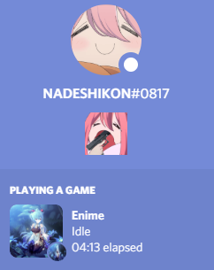
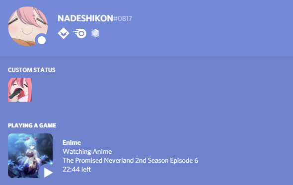

# Enime

## _Electron Anime Desktop App_

Leave a star to the repository is you like this project and believes in the potential of it :)

Enime is a cross-platform desktop app that allows you to enjoy your anime time

## Features

- Built-in [mpv](https://github.com/mpv-player/mpv) player powered by [mpv.js](https://github.com/Kagami/mpv.js) that allows on-fly multi-language subtitle embedded in the video
- Discord RPC integrated, you can optionally show your friends what anime and what episode you are currently watching!
- Fetch recent releases. Enime automatically parse corresponding anime from various sub teams from [nyaa](https://nyaa.si) and obtain video source from the torrents
- _More to be included_

## Screenshots

_Note: The current screenshots are from the (very) initial version of the project and do not possibly indicate the final product, they will be periodically updated as the project progresses_

## Contributing

1. Fork the repository
2. Create a branch indicting your feature: `git checkout -b feature`
3. Commit your changes: `git commit -m 'Adding xxx feature'`
4. Push to your forked repository's feature branch: `git push origin feature`
5. Create a pull request at [here](https://github.com/Enime-Project/enime/pulls)

## License

Enime is licensed under [MIT](https://github.com/Enime-Project/enime/master/LICENSE)

