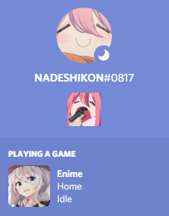
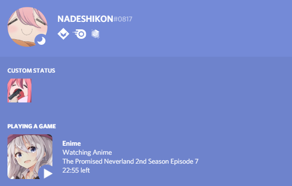
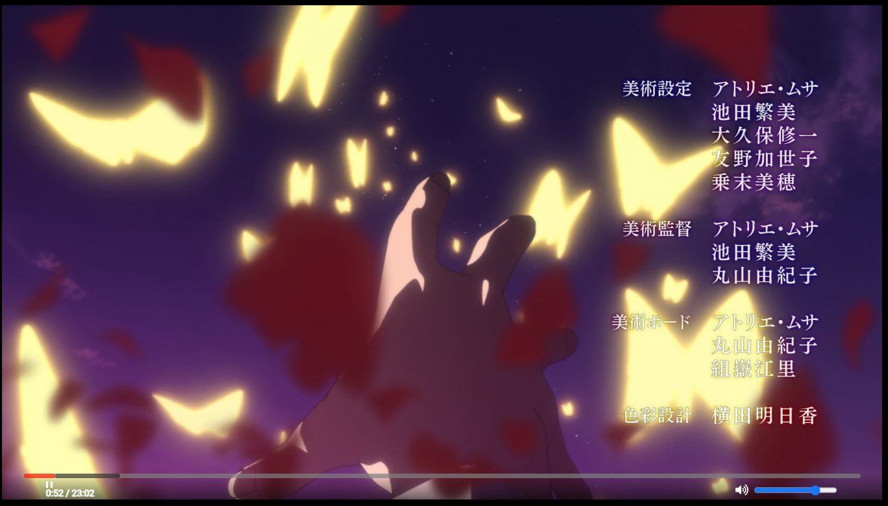

    

    

<h1 align="center">Enime</h1>
<h2 align="center"><i>Anime on Desktop</i></h2>

Leave a star to the repository if you like this project and believe in its potential :)

Enime is a cross-platform desktop app that allows you to experience ad-free anime without disruptions

## Features

- Built-in [mpv](https://github.com/mpv-player/mpv) player powered by [mpv.js](https://github.com/Kagami/mpv.js) that allows on-fly multi-language subtitle embedded in the video among with various controls in the interface!
- Integrated Discord RPC, you can optionally show your friends what anime and what episode you are currently watching!
- _More to be included_

## Installations

Enime is currently not publicly available to download via GitHub Releases. However, you can attempt to run the application in test mode:

1. Clone the repository
    - If you don't have yarn installed, please install yarn via `npm install -g yarn`
2. Head to the terminal with directory pointed to the project folder, execute `yarn install`
3. Run the app via `yarn start`

## Demo

_Note: The current screenshots are from the (very) initial version of the project and do not possibly indicate the final product, they will be periodically updated as the project progresses_

## Contributing

1. Fork the repository
2. Create a branch indicting your feature: `git checkout -b feature`
3. Commit your changes: `git commit -m 'Adding xxx feature'`
4. Push to your forked repository's feature branch: `git push origin feature`
5. Create a pull request at [here](https://github.com/Enime-Project/enime/pulls)

## Contributors

## Tech Used

- [electron](https://www.electronjs.org/) - Framework to create desktop app via JS
- [Svelte](https://svelte.dev//) - Frontend framework
- [mpv.js](https://github.com/Enime-Project/mpv.js) - Video player utility that has capability to display mkv subtitles on fly, created an enime exclusive binary version to fix crucial bugs

## License

Enime is licensed under [MIT](https://github.com/Enime-Project/enime/master/LICENSE)

